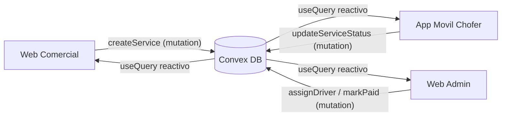

# Plan: App "Choferes de Reemplazo" (Monorepo Convex + React + Expo)

## Arquitectura general

Monorepo con `pnpm workspaces` + `Turborepo`. Un solo paquete de backend Convex compartido por las 3 apps, lo que garantiza tipos y validadores reutilizados end-to-end.

```
proyecto/
├─ package.json            # workspaces + scripts turbo
├─ pnpm-workspace.yaml
├─ turbo.json
├─ tsconfig.base.json      # TS estricto compartido
├─ packages/
│  └─ backend/             # Backend Convex (única fuente de verdad)
│     ├─ convex/
│     │  ├─ schema.ts
│     │  ├─ auth.ts
│     │  ├─ auth.config.ts
│     │  ├─ http.ts
│     │  ├─ users.ts
│     │  ├─ drivers.ts
│     │  ├─ services.ts
│     │  ├─ payments.ts
│     │  ├─ payouts.ts
│     │  ├─ lib/auth.ts       # helpers: getCurrentUser, requireRole, requireDriver
│     │  └─ lib/constants.ts  # COMMISSION_RATE + cálculo de comisión
│     └─ package.json
└─ apps/
   ├─ web-comercial/       # Vite + React + Tailwind (clientes solicitan chofer)
   ├─ web-admin/           # Vite + React + Tailwind (pagos y comisiones)
   └─ mobile/              # Expo + NativeWind (choferes, tiempo real)
```

### Flujo de datos (tiempo real)



## 1. Configuración del monorepo

- `pnpm-workspace.yaml`: incluir `apps/*` y `packages/*`.
- `package.json` raíz: scripts `dev`, `build`, `lint` vía Turbo; `turbo.json` con pipeline (`backend#dev` como dependencia de las apps).
- `tsconfig.base.json` con `"strict": true`, `noUncheckedIndexedAccess`, `exactOptionalPropertyTypes`. Cada app/paquete extiende esta base.
- Las apps importan el cliente generado del backend vía alias del workspace (`@proyecto/backend` exportando `convex/_generated/api`).

## 2. Backend Convex — Schema (`packages/backend/convex/schema.ts`)

Schema estricto con `defineSchema`/`defineTable`, validadores `v.*`, `v.union(v.literal(...))` para enums, e índices para las consultas frecuentes. Se incluyen las tablas de Convex Auth vía `...authTables`.

- **users**: extiende auth. Campos: `name`, `email`, `phone?`, `role` (`v.union` de `"client" | "admin"`). Índices `email` y `phone`.
- **drivers**: `userId` (ref a users), `status` (`"available" | "busy" | "offline"`), `vehicle` (objeto: `make`, `model`, `plate`, `year`, `color?`), `licenseNumber`, `licenseExpiry`, `rating` (number), `totalTrips`. Índices `by_user` y `by_status` (clave para asignación rápida).
- **services**: `clientId` (ref users), `driverId?` (ref drivers), `origin`/`destination` (objeto `{ address, lat, lng }`), `totalPrice`, `driverCommission`, `status` (`"pending" | "assigned" | "en_route" | "finished" | "cancelled"`), `requestedAt`, `assignedAt?`, `finishedAt?`, `cancelledAt?`. Índices `by_client`, `by_driver`, `by_status`, `by_driver_status`.
- **payments**: `serviceId` (ref services), `clientId` (ref users), `amount`, `method?`, `status` (`"pending" | "paid"`), `paidAt?`. Índices `by_service`, `by_client`, `by_status`.
- **payouts**: `driverId` (ref drivers), `accumulatedAmount`, `paidAmount`, `status` (`"pending" | "paid"`), `periodStart?`, `periodEnd?`, `paidAt?`. Índices `by_driver`, `by_status`, `by_driver_status`.

Ejemplo del estilo seguido en `schema.ts`:

```ts
services: defineTable({
  clientId: v.id("users"),
  driverId: v.optional(v.id("drivers")),
  origin: v.object({ address: v.string(), lat: v.number(), lng: v.number() }),
  destination: v.object({ address: v.string(), lat: v.number(), lng: v.number() }),
  totalPrice: v.number(),
  driverCommission: v.number(),
  status: v.union(
    v.literal("pending"), v.literal("assigned"),
    v.literal("en_route"), v.literal("finished"), v.literal("cancelled"),
  ),
  requestedAt: v.number(),
  assignedAt: v.optional(v.number()),
  finishedAt: v.optional(v.number()),
})
  .index("by_client", ["clientId"])
  .index("by_driver", ["driverId"])
  .index("by_status", ["status"]),
```

## 3. Backend Convex — Auth y autorización

- `convex/auth.ts` + `convex/auth.config.ts` + `convex/http.ts`: configurar Convex Auth (provider Password para empezar). Incluir `...authTables` en el schema.
- `convex/lib/auth.ts`: helpers `getCurrentUser(ctx)`, `requireUser(ctx)`, `requireRole(ctx, role)` y `requireDriver(ctx)` para proteger mutations/queries (admin vs client vs chofer).

## 4. Backend Convex — Funciones (query lee, mutation escribe)

- **users.ts**: `getMe` (query), `updateProfile` (mutation), `setRole` (mutation admin), `listAll` (query admin).
- **drivers.ts**: `listAvailable` (query, usa `by_status`), `listAll` (query admin), `getMyDriverProfile` (query), `setStatus` (mutation: disponible/ocupado/offline), `upsertDriverProfile` (mutation).
- **services.ts**:
  - `createService` (mutation, cliente) — calcula `driverCommission` desde `totalPrice` y un porcentaje configurable.
  - `assignDriver` (mutation, admin) — set `driverId`, `status="assigned"`, marca driver `busy`.
  - `updateStatus` (mutation, chofer) — transiciones `assigned → en_route → finished`, libera driver, genera el pago pendiente y acumula la comisión al finalizar.
  - `cancelService` (mutation, cliente dueño o admin).
  - `listForDriver` (query, app móvil, reactiva), `listForClient` (query), `getById` (query), `listAllForAdmin` (query con filtros por estado).
- **payments.ts**: `markPaid` (mutation admin), `listPending` (query admin), `listAll` (query admin), `listForClient` (query).
- **payouts.ts**: `markPaid` (mutation admin), `listByDriver` (query admin), `listPending` (query admin), `listMine` (query chofer). La acumulación de comisiones ocurre dentro de `services.updateStatus`.

## 5. App Web Comercial (`apps/web-comercial`)

- Vite + React + TypeScript + Tailwind. `ConvexAuthProvider`.
- Pantallas: solicitud de servicio (form origen/destino/precio), seguimiento del servicio en tiempo real con `useQuery`, login/registro de cliente.

## 6. App Web Admin (`apps/web-admin`)

- Vite + React + TS + Tailwind, acceso restringido a `role="admin"`.
- Pantallas: tablero de servicios (filtro por estado), asignación de chofer, gestión de pagos de clientes (`markPaid`), cálculo y liquidación de comisiones/payouts por chofer.

## 7. App Móvil Choferes (`apps/mobile`)

- Expo + NativeWind (config Tailwind para RN). `ConvexAuthProvider` + auth con almacenamiento seguro (`expo-secure-store`).
- Reglas estrictas: **solo** componentes de `react-native` (`View`, `Text`, `TouchableOpacity`, `TextInput`, `FlatList`...), nunca etiquetas HTML.
- Pantallas: login chofer, toggle de disponibilidad (`setStatus`), lista de solicitudes en tiempo real (`useQuery` de `listForDriver`), tarjeta de servicio con botones de transición de estado.

## 8. Orden de implementación seguido

1. Andamiaje monorepo (pnpm + turbo + tsconfig base).
2. Backend: `schema.ts` + Convex Auth + helpers de roles.
3. Funciones Convex (users, drivers, services, payments, payouts).
4. Web comercial (solicitud + seguimiento).
5. Web admin (asignación + pagos + comisiones).
6. App móvil chofer (tiempo real + estados).

## Notas / decisiones tomadas

- Porcentaje de comisión: definido como constante configurable en el backend (`COMMISSION_RATE = 0.2` en `convex/lib/constants.ts`); ajustable luego.
- Asignación de chofer: en esta primera fase es manual desde el admin (`assignDriver`); más adelante se puede automatizar por cercanía/disponibilidad.
- Mapas/geolocalización en vivo del chofer queda fuera del alcance inicial (el schema ya guarda lat/lng para habilitarlo después).
- El rol `admin` se asigna manualmente (`users.setRole`); el registro público crea usuarios `client`. Un chofer opera en la app móvil tras crear su perfil en `drivers` (`upsertDriverProfile`).
