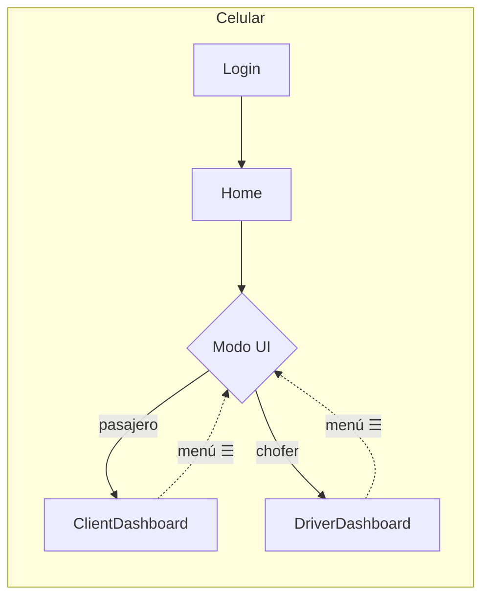
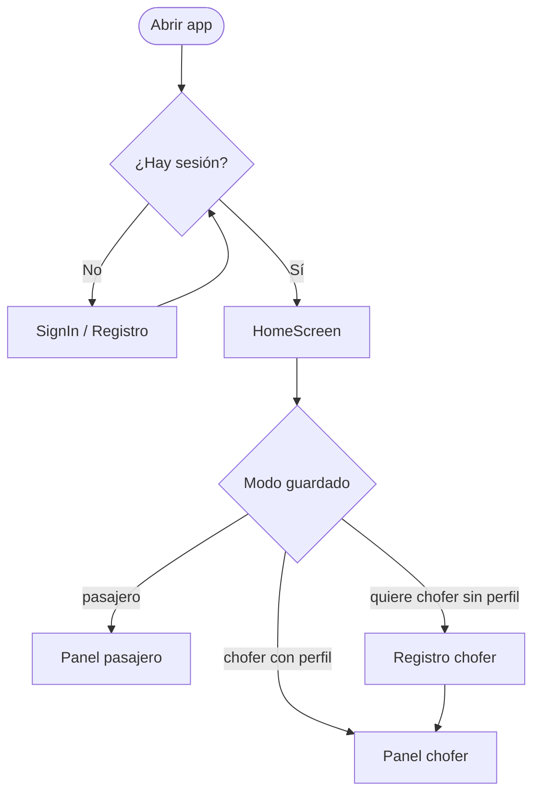
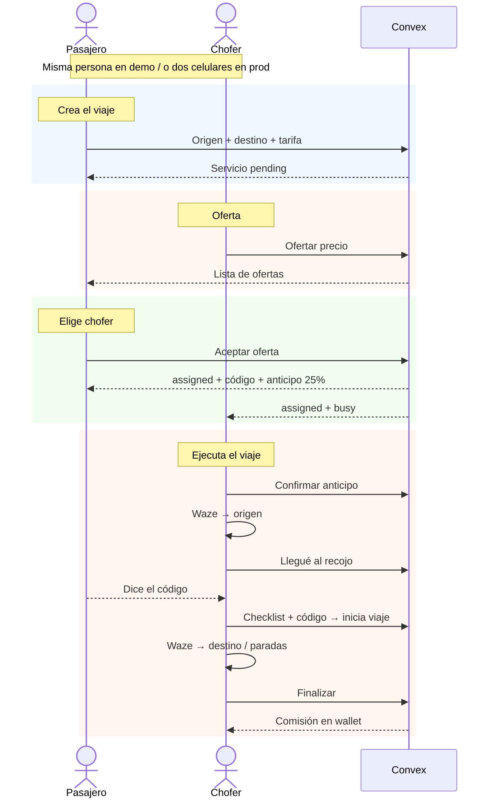
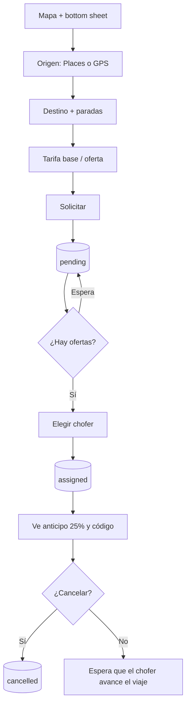
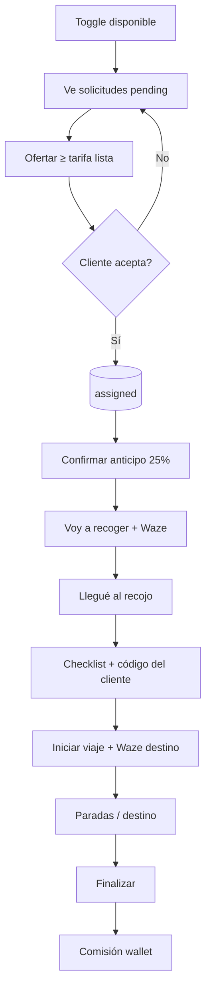
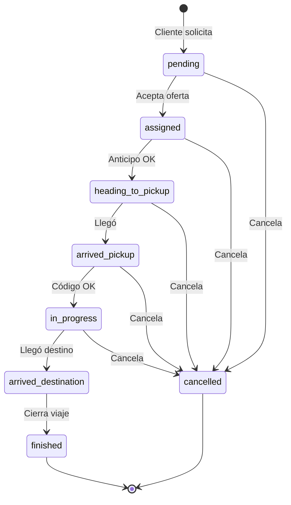
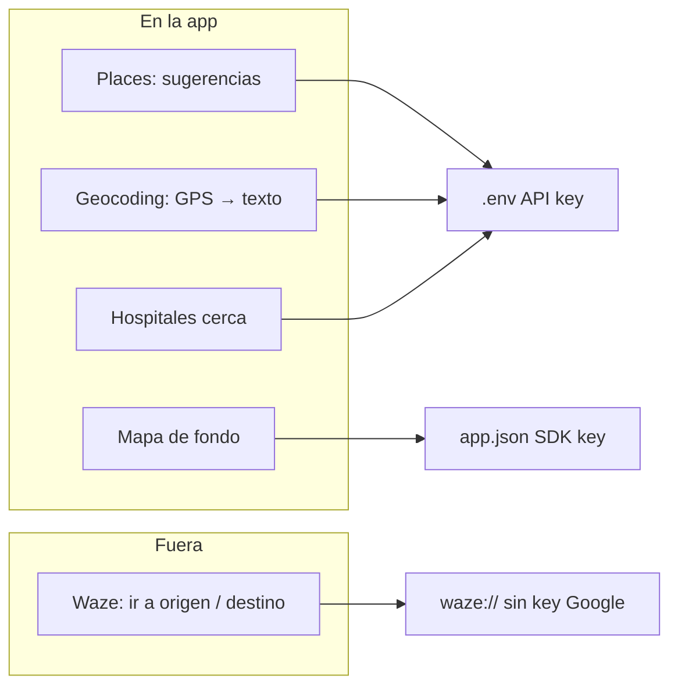

# Flujo móvil Hercom (cómo funciona hoy)

Hay **3 flujos UI**. Detalle y archivos: [3-flujos-ui.md](./3-flujos-ui.md).

## 1. Inscripción del chofer

| Momento | Chofer (app) | Web interna |
| --- | --- | --- |
| **Inscripción** | Alta conductor `DriverRegisterScreen.tsx` | Lista + expediente `DriversView.tsx` + `DriverDossierPanel.tsx` |
| **Revisión** | Expediente enviado `DriverApplicationPendingScreen.tsx` | Aprobar / Rechazar `DriverDossierPanel.tsx` |

## 2. Recarga de saldo del chofer

| Momento | Chofer (app) | Web interna |
| --- | --- | --- |
| **Recarga** | Recargar saldo `DriverDashboard.tsx` | Recargas de billetera `TopUpsView.tsx` |

## 3. Flujo de servicio

| Momento | Cliente | Chofer | Web interna |
| --- | --- | --- | --- |
| **Pedir viaje** | Pedir servicio `ClientDashboard.tsx` | — | Tablero · Pendiente `ServicesView.tsx` + `ServicesBoard.tsx` |
| **Entregar oferta** | Ofertas recibidas `ClientDashboard.tsx` | Solicitudes abiertas `DriverDashboard.tsx` | Tablero · Pendiente `ServicesBoard.tsx` |
| **Aceptar oferta** | Aceptar chofer `DriverOfferModal.tsx` | Espera asignación `DriverDashboard.tsx` | Tablero · Asignado `ServicesBoard.tsx` |
| **Adelanto** | Transferir 25% `AdvancePayoutModal.tsx` | Confirmar anticipo `ServiceCard.tsx` | Columna Anticipo `ServicesBoard.tsx` |
| **Salida del chofer** | Chofer en camino `ClientDashboard.tsx` | Voy a recoger `ServiceCard.tsx` | Yendo a recoger + mapa `ServicesBoard.tsx` + `ServiceLivePanel.tsx` |
| **Llegada del chofer** | Chofer en el punto `ClientDashboard.tsx` | Llegué al recojo `ServiceCard.tsx` | Llegó al punto `ServicesBoard.tsx` |
| **Checklist** | — | Checklist de recojo `ChecklistRecojoScreen.tsx` | — |
| **Inicio de viaje** | Viaje en vivo `LiveTripMapModal.tsx` | Código e iniciar `ServiceCard.tsx` | En viaje + mapa `ServicesBoard.tsx` + `ServiceLivePanel.tsx` |
| **Fin de viaje** | Calificar `RateServiceStars.tsx` | Finalizar viaje `ServiceCard.tsx` | Finalizado + pagos `ServicesBoard.tsx` + `PaymentsPanel.tsx` + `PayoutsPanel.tsx` |

Inventario de documentos del chofer: [flujo-ui-chofer-admin.md](./flujo-ui-chofer-admin.md)

> Cómo ver los diagramas de más abajo: clic derecho → **Open Preview**.
> Detalle de estados Convex: sigue en las secciones 2–5.

---

## Vista general — dos modos, misma cuenta

- Una cuenta = puede ser pasajero **y** chofer.
- El modo se guarda en el celular; el perfil chofer vive en Convex (`drivers`).
- Demo/QA: se puede ofertar en una solicitud propia (un solo equipo).

---

## 1. Arranque de la app

---

## 2. Viaje completo — pasajero y chofer **en paralelo**

Lee de arriba a abajo: la columna izquierda es el cliente; la derecha, el chofer.
Las flechas horizontales son el momento en que uno espera al otro.

---

## 3. Solo pasajero — pedir viaje

---

## 4. Solo chofer — ofertar y conducir

---

## 5. Estados del servicio (máquina simple)

`cancelled` y `finished` **no se borran**: quedan en historial / auditoría.

---

## 6. Mapas y navegación (quién hace qué)

Detalle: [google-maps-y-waze.md](./google-maps-y-waze.md).

---

## 7. Qué NO está pulido aún (brechas)

| Tema | Hoy |
| --- | --- |
| Aprobación chofer | Se crea activo al instante (demo) |
| Código de seguridad | También lo ve el chofer en UI |
| Soporte | Número placeholder |
| Menú lateral | Varios ítems aún stub |
| Oferta propia | Permitida para QA con 1 equipo |

---

## Cómo usarlo

1. Mira el diagrama **§2** (paralelo): es el modelo mental del viaje.
2. Si algo no coincide con lo que quieres, anótalo como brecha.
3. Cuando §2 y §5 coincidan con producto, congela antes del build.
