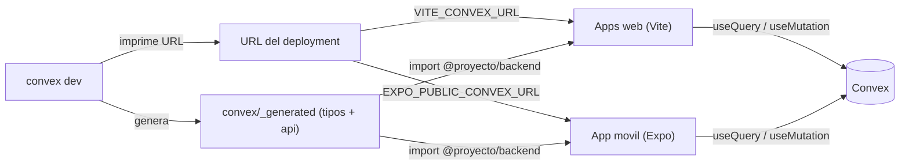

# Conectar el proyecto con Convex y con Expo

Guía de extremo a extremo: desde cero hasta tener el backend de Convex
funcionando, las cuentas de demo cargadas y la app móvil corriendo en un
celular. Pensado para Windows (PowerShell), pero los comandos son iguales en
macOS/Linux.

> Resumen del flujo: **Convex** corre el backend y te da una **URL de
> deployment**. Esa URL se pone en un archivo `.env` de cada app. Cada cliente
> (web o móvil) lee esa URL y se conecta en tiempo real al mismo backend.



---

## 0. Requisitos previos

1. **Node.js 18 o superior** — descárgalo de https://nodejs.org (instala la
   versión LTS). Verifica:

   ```powershell
   node --version
   npm --version
   ```

2. **pnpm 9** (gestor del monorepo):

   ```powershell
   npm install -g pnpm
   pnpm --version
   ```

3. Una **cuenta gratuita de Convex** (https://convex.dev). Te pedirá iniciar
   sesión la primera vez con `convex dev`.

---

## 1. Instalar dependencias

Desde la raíz del proyecto (instala todo el monorepo de una vez):

```powershell
cd C:\Users\jorge\Documents\proyecto
pnpm install
```

---

## 2. Conectar con Convex (backend)

### 2.1 Iniciar el backend por primera vez

```powershell
pnpm --filter @proyecto/backend dev
```

La primera vez este comando:

- Abre el navegador para **iniciar sesión** en Convex.
- Te deja **crear/seleccionar un proyecto**.
- Genera la carpeta `packages/backend/convex/_generated` (los tipos y el objeto
  `api` que importan las apps). **Hasta correr esto, el editor marcará errores
  de "módulo no encontrado": es normal.**
- Sincroniza el `schema.ts` y las funciones, y queda **escuchando** cambios.
- Crea/actualiza `packages/backend/.env.local` con `CONVEX_DEPLOYMENT`.

Verás en la terminal algo como:

```
✔ Provisioned a dev deployment and saved its name to .env.local
  Deployment URL: https://abc-123.convex.cloud
```

Copia esa **Deployment URL**: la usarás en las apps.

> Deja esta terminal abierta mientras desarrollas. Cada cambio en
> `packages/backend/convex/*.ts` se publica automáticamente.

### 2.2 Activar Convex Auth (una sola vez)

El login usa Convex Auth, que necesita llaves JWT. En **otra terminal**:

```powershell
cd C:\Users\jorge\Documents\proyecto\packages\backend
npx @convex-dev/auth
```

Esto configura `JWT_PRIVATE_KEY` y `JWKS` en tu deployment automáticamente.
Cuando termine, el login de las tres apps ya funcionará.

### 2.3 Cargar los datos de demostración (seed)

Con el backend corriendo (paso 2.1), ejecuta en **otra terminal**:

```powershell
cd C:\Users\jorge\Documents\proyecto\packages\backend
npx convex run seed:seedDemo
```

Crea tres cuentas que **sí pueden iniciar sesión** y un viaje de ejemplo ya
asignado al chofer:

| Rol | Email | Contraseña |
| --- | --- | --- |
| Admin | `admin@demo.com` | `demo1234` |
| Chofer | `chofer@demo.com` | `demo1234` |
| Cliente | `cliente@demo.com` | `demo1234` |

El seed es idempotente: puedes correrlo varias veces sin duplicar datos.

---

## 3. Cómo lee cada app la URL de Convex

La URL del deployment se inyecta por variable de entorno. El nombre **cambia
según la plataforma**:

| App | Archivo | Variable |
| --- | --- | --- |
| `apps/web-comercial` | `.env.local` | `VITE_CONVEX_URL` |
| `apps/web-admin` | `.env.local` | `VITE_CONVEX_URL` |
| `apps/mobile` | `.env` | `EXPO_PUBLIC_CONVEX_URL` |

En el código, la conexión se crea así (ya está implementado):

```ts
// Web (apps/web-*/src/main.tsx)
const convex = new ConvexReactClient(import.meta.env.VITE_CONVEX_URL);

// Móvil (apps/mobile/App.tsx)
const convex = new ConvexReactClient(process.env.EXPO_PUBLIC_CONVEX_URL);
```

Vite expone variables que empiezan por `VITE_`; Expo expone las que empiezan por
`EXPO_PUBLIC_`. Por eso los nombres son distintos.

### Crear los archivos de entorno

```powershell
# Webs (usa tu URL real en lugar del ejemplo)
"VITE_CONVEX_URL=https://abc-123.convex.cloud" | Out-File -Encoding utf8 apps\web-comercial\.env.local
"VITE_CONVEX_URL=https://abc-123.convex.cloud" | Out-File -Encoding utf8 apps\web-admin\.env.local

# Móvil
"EXPO_PUBLIC_CONVEX_URL=https://abc-123.convex.cloud" | Out-File -Encoding utf8 apps\mobile\.env
```

(También puedes copiar los `.env.example` que ya existen en cada app y pegar la
URL a mano.)

---

## 4. Correr las apps web

Con el backend corriendo, en terminales separadas:

```powershell
pnpm web:comercial   # http://localhost:5173  (clientes)
pnpm web:admin       # http://localhost:5174  (administradores)
```

Prueba el flujo:

1. En la **web comercial** inicia sesión como `cliente@demo.com` y crea un
   servicio.
2. En la **web admin** inicia sesión como `admin@demo.com`, ve el servicio
   pendiente y asígnalo a un chofer disponible.

---

## 5. Conectar con Expo (app móvil)

### 5.1 Instalar Expo Go en el teléfono

- **iOS**: App Store → "Expo Go".
- **Android**: Play Store → "Expo Go".

### 5.2 Levantar el servidor de Expo

```powershell
pnpm mobile
```

Aparece un **código QR** en la terminal.

- **Android**: abre **Expo Go** → "Scan QR code" → escanea.
- **iOS**: abre la **cámara**, apunta al QR y toca la notificación.

Requisito: el teléfono y la computadora deben estar en la **misma red Wi-Fi**.

### 5.3 Si el QR no conecta (redes distintas)

Usa el **modo túnel**:

```powershell
pnpm --filter @proyecto/mobile start -- --tunnel
```

(La primera vez instala `@expo/ngrok`; acepta.)

### 5.4 Probar en el móvil

Inicia sesión como `chofer@demo.com` / `demo1234`. Verás el viaje de demo ya
asignado y podrás pulsar **Iniciar viaje** y luego **Finalizar viaje**. Al
finalizar, en la web admin aparecerá el pago pendiente del cliente y la comisión
acumulada del chofer, todo en tiempo real.

---

## 6. ¿Y Git? (opcional)

Git **no es necesario** para correr Convex ni Expo. Solo sirve para versionar el
código. Si quieres usarlo:

```powershell
cd C:\Users\jorge\Documents\proyecto
git init
git add .
git commit -m "Estructura inicial Choferes de Reemplazo"
```

Los archivos `.env`, `node_modules/` y `convex/_generated/` ya están ignorados
por el `.gitignore`.

---

## 7. Tabla de terminales para la demo completa

| Terminal | Comando | Estado |
| --- | --- | --- |
| 1 | `pnpm --filter @proyecto/backend dev` | Debe quedar abierta |
| 2 | `pnpm web:comercial` | Opcional (clientes) |
| 3 | `pnpm web:admin` | Opcional (admin) |
| 4 | `pnpm mobile` | App móvil + QR |

Comandos de una sola vez (no necesitan quedar abiertos): `npx @convex-dev/auth`
y `npx convex run seed:seedDemo`.

---

## 8. Problemas comunes

| Síntoma | Causa / solución |
| --- | --- |
| El editor marca "Cannot find module './_generated/...'" | Aún no corres `convex dev`. Ejecuta el paso 2.1. |
| `Falta EXPO_PUBLIC_CONVEX_URL` al abrir la app | Falta `apps/mobile/.env` con la URL (paso 3). |
| Login falla siempre | Falta ejecutar `npx @convex-dev/auth` (paso 2.2). |
| El QR no abre la app | Distinta red Wi-Fi → usa `--tunnel` (paso 5.3). |
| No aparece ningún viaje en el móvil | Corre el seed (paso 2.3) o asigna un servicio desde la web admin. |
