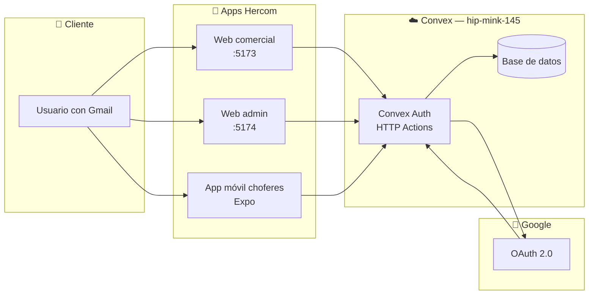
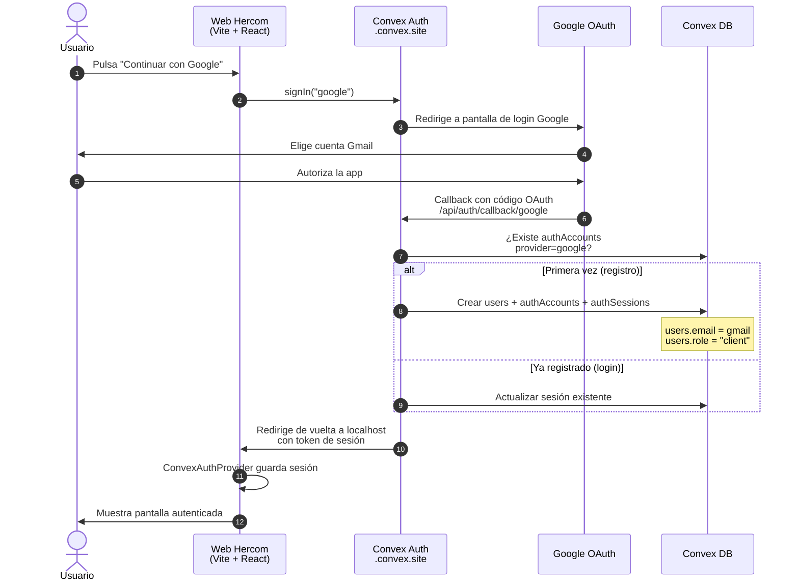
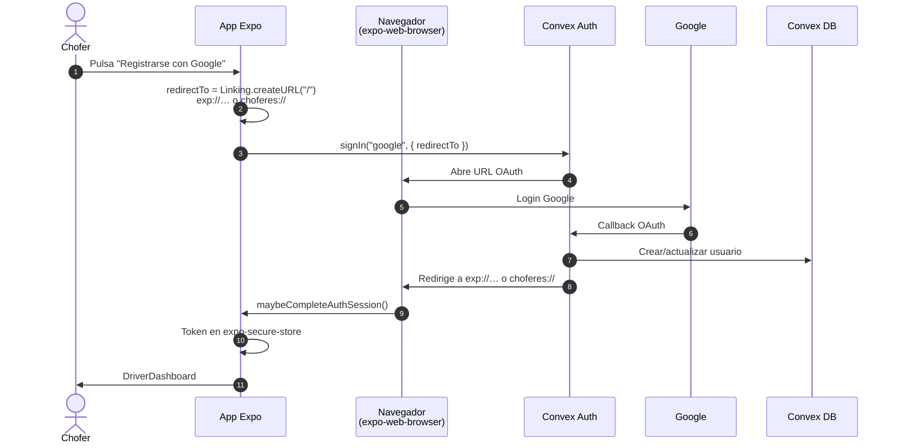
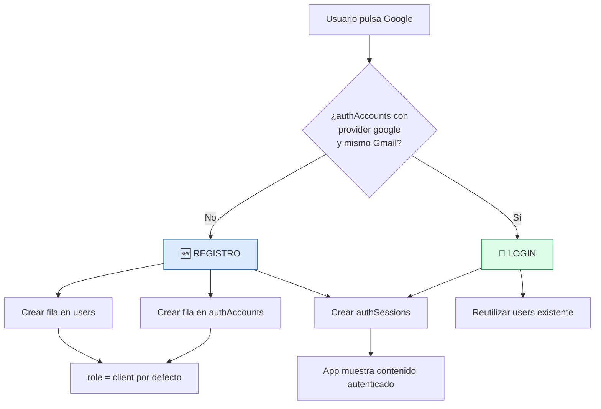
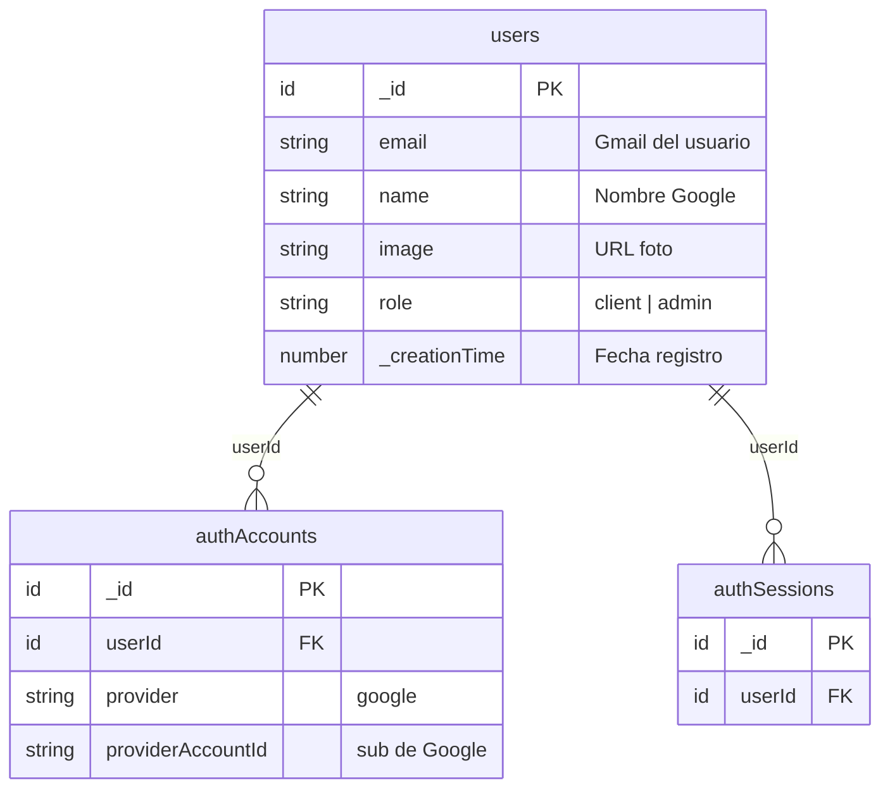
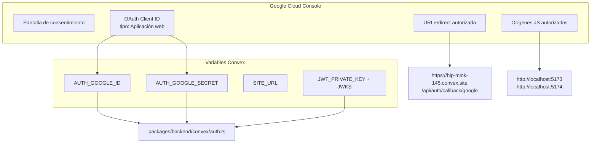
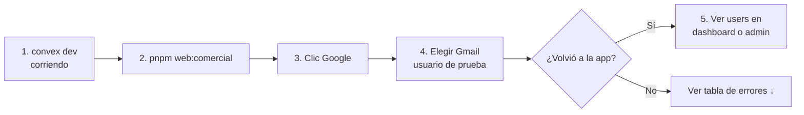
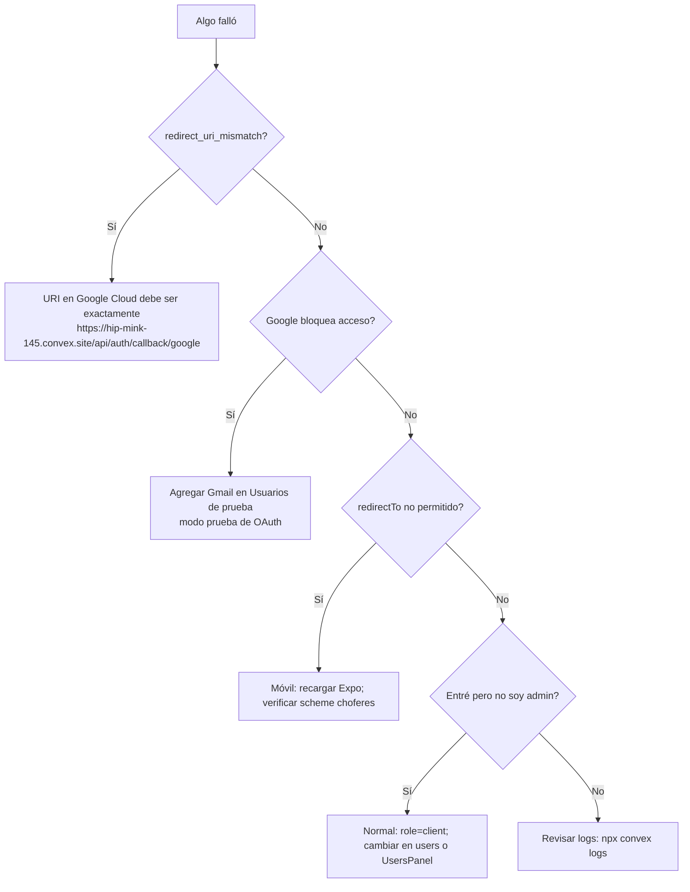

# Flujo de registro e inicio de sesión con Google

Documento visual del proceso OAuth configurado en Hercom. Complementa la guía de
setup en [`convex-google-auth.md`](./convex-google-auth.md).

---

## Resumen en una imagen mental

```
┌─────────────┐     ┌──────────────┐     ┌─────────────┐     ┌──────────────┐
│   Usuario   │────▶│  App Hercom  │────▶│   Convex    │────▶│    Google    │
│  (Gmail)    │◀────│ web / móvil  │◀────│  Auth + DB  │◀────│    OAuth     │
└─────────────┘     └──────────────┘     └─────────────┘     └──────────────┘
                           │                     │
                           │                     ▼
                           │              ┌──────────────┐
                           └─────────────▶│ users.email  │
                                          │ role: client │
                                          └──────────────┘
```

**Idea clave:** el usuario nunca envía su contraseña de Google a Hercom. Google
confirma la identidad; Convex crea o reutiliza la cuenta y guarda el Gmail en
`users.email`.

---

## Actores del sistema



| Actor | Rol |
| --- | --- |
| **Usuario** | Elige cuenta Google y autoriza el acceso |
| **App (web/móvil)** | Muestra botón Google y guarda la sesión local |
| **Convex Auth** | Orquesta OAuth, crea sesión JWT, escribe en BD |
| **Google** | Autentica al usuario y devuelve email, nombre y foto |

---

## Flujo completo — Web (comercial o admin)



### Qué archivo dispara cada paso (web)

| Paso | Archivo |
| --- | --- |
| Botón Google | `apps/web-comercial/src/components/GoogleSignInButton.tsx` |
| Pantalla login | `apps/web-comercial/src/components/SignInForm.tsx` |
| Provider de sesión | `apps/web-comercial/src/main.tsx` → `ConvexAuthProvider` |
| Rutas OAuth backend | `packages/backend/convex/http.ts` → `auth.addHttpRoutes` |
| Provider Google + perfil | `packages/backend/convex/auth.ts` → `ProviderGoogle` |

---

## Flujo completo — App móvil (solo Google)



| Detalle móvil | Valor |
| --- | --- |
| Scheme nativo | `choferes` (`apps/mobile/app.json`) |
| Expo Go | `exp://192.168.x.x:8081/--/` |
| Almacén de sesión | `expo-secure-store` en `App.tsx` |
| Redirect permitido | Validado en `auth.ts` → callback `redirect` |

---

## ¿Registro o login? — Es el mismo flujo



No hay pantalla de “registro” separada: **el primer acceso con Google crea la
cuenta automáticamente**.

---

## Qué se guarda en la base de datos



### Ejemplo visual de una fila tras registrarse

```
┌──────────────────────────────────────────────────────────────────┐
│  Tabla: users                                                    │
├─────────────────┬────────────────────────────────────────────────┤
│ email           │ juan.perez@gmail.com                           │
│ name            │ Juan Pérez                                     │
│ image           │ https://lh3.googleusercontent.com/...          │
│ role            │ client                                         │
│ _creationTime   │ 2026-06-09 10:30                               │
└─────────────────┴────────────────────────────────────────────────┘
```

### Dónde verlo en el proyecto

| Lugar | Cómo |
| --- | --- |
| **Dashboard Convex** | [Data → users](https://dashboard.convex.dev/d/hip-mink-145) |
| **Panel admin** | `pnpm web:admin` → sección **Cuentas registradas** |
| **Código** | Query `api.users.listAll` (solo admins) |

---

## Mapa de configuración externa



---

## Estado de verificación (código + deployment)

Verificado contra el repositorio y el deployment `hip-mink-145`:

| Check | Estado | Notas |
| --- | :---: | --- |
| Provider Google en `auth.ts` | ✅ | Guarda `email`, `name`, `image`, `role: client` |
| Rutas HTTP Auth (`http.ts`) | ✅ | `auth.addHttpRoutes(http)` |
| Callback `redirect` (web + móvil) | ✅ | Permite `localhost`, `exp://`, `choferes://` |
| `AUTH_GOOGLE_ID` en Convex | ✅ | Configurado |
| `AUTH_GOOGLE_SECRET` en Convex | ✅ | Configurado |
| Claves JWT (`JWKS`, `JWT_PRIVATE_KEY`) | ✅ | Generadas por `@convex-dev/auth` |
| Botón Google web comercial | ✅ | `signIn("google")` |
| Botón Google web admin | ✅ | `signIn("google")` |
| Botón Google móvil | ✅ | `signIn("google", { redirectTo })` |
| Scheme móvil `choferes` | ✅ | `app.json` |
| Panel admin usuarios registrados | ✅ | `UsersPanel.tsx` |
| Usuarios Google en BD ahora mismo | ⚠️ | Solo cuentas seed (`*@demo.com`); falta probar login real |

### Ajuste recomendado

`SITE_URL` en Convex está en `http://localhost:3000`, pero las webs corren en
**5173** y **5174**. No bloquea OAuth (el callback va a `.convex.site`), pero
conviene alinearlo:

```powershell
cd packages/backend
npx convex env set SITE_URL http://localhost:5173
```

---

## Cómo probar tú mismo (checklist)



### Web comercial

```powershell
# Terminal 1
pnpm --filter @proyecto/backend dev

# Terminal 2
pnpm web:comercial
```

1. Abre `http://localhost:5173`
2. **Continuar con Google**
3. Inicia sesión con un Gmail añadido como **usuario de prueba** en Google Cloud
4. Deberías ver el formulario de solicitar servicio
5. En admin (`pnpm web:admin`) → **Cuentas registradas** aparece tu Gmail

### App móvil

```powershell
pnpm mobile -- --clear
```

1. Splash Hercom → **Registrarse con Google**
2. Navegador Google → autorizar → vuelve a Expo
3. Si no hay perfil chofer, verás el dashboard básico (login OK)

---

## Árbol de errores frecuentes



---

## Comparativa por app

| | Web comercial | Web admin | App móvil |
| --- | --- | --- | --- |
| **Login Google** | ✅ Sí | ✅ Sí | ✅ Solo Google |
| **Login password** | ✅ Sí | ✅ Sí | ❌ No |
| **Rol inicial Google** | `client` | `client` | `client` |
| **Acceso tras Google** | Solicitar servicios | Solo si `role=admin` | Dashboard chofer |
| **redirectTo** | Automático (URL actual) | Automático | `Linking.createURL("/")` |
| **Almacén sesión** | Cookies / localStorage | Igual | SecureStore |

---

## Referencias en el código

```
packages/backend/convex/
├── auth.ts          ← Provider Google + callback redirect
├── auth.config.ts   ← Dominio Convex para JWT
├── http.ts          ← Rutas /api/auth/*
├── schema.ts        ← Tabla users + authTables
└── users.ts         ← getMe, listAll, setRole

apps/web-comercial/src/components/GoogleSignInButton.tsx
apps/web-admin/src/components/GoogleSignInButton.tsx
apps/mobile/src/components/GoogleSignInButton.tsx
apps/web-admin/src/components/UsersPanel.tsx   ← ver registrados
```

---

## Documentos relacionados

- [convex-google-auth.md](./convex-google-auth.md) — setup paso a paso en Google Cloud
- [opciones-autenticacion.md](./opciones-autenticacion.md) — alternativas (SMS, etc.)
- [Convex Auth — Google](https://labs.convex.dev/auth/config/oauth/google) — documentación oficial
