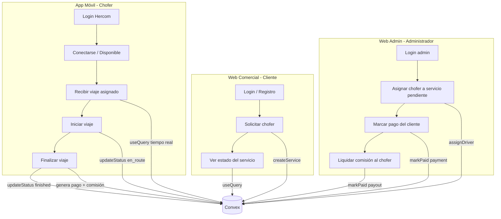

# Flujo de vistas y funcionalidades — Hercom Choferes

Guía orientada a alguien **ajeno al código** que necesita entender qué pantallas existen,
quién las usa, qué hace cada una y cómo se conectan entre sí.

---

## Resumen del sistema

Hercom es una plataforma de **choferes para reemplazo** con tres clientes y un backend
compartido:

| Cliente | Usuario | Puerto local | URL de acceso |
| --- | --- | --- | --- |
| App móvil | Chofer | Expo Go (QR) | `pnpm mobile` |
| Web comercial | Cliente | 5173 | `pnpm web:comercial` |
| Web admin | Administrador | 5174 | `pnpm web:admin` |
| Backend | — | — | Convex (`hip-mink-145.convex.cloud`) |

---

## Vistas implementadas hasta ahora

### App móvil (chofer) — 3 pantallas / estados

| # | Vista | Archivo | Cuándo se ve |
| --- | --- | --- | --- |
| 1 | **Login Hercom** | `apps/mobile/src/screens/SignInScreen.tsx` | Al abrir la app sin sesión |
| 2 | **Sin perfil de chofer** | `apps/mobile/src/screens/DriverDashboard.tsx` (bloque `driver === null`) | Tras login, si la cuenta no tiene registro en `drivers` |
| 3 | **Panel del chofer** | `apps/mobile/src/screens/DriverDashboard.tsx` | Tras login con perfil de chofer válido |

**Componentes dentro del panel del chofer:**

| Componente | Archivo | Función |
| --- | --- | --- |
| Logo Hercom | `src/components/HercomLogo.tsx` | Muestra el logo institucional |
| Toggle disponibilidad | `src/components/AvailabilityToggle.tsx` | Botón disponible / desconectado / en servicio |
| Tarjeta de viaje | `src/components/ServiceCard.tsx` | Detalle del viaje + Iniciar / Finalizar |

> **Pendiente de diseño:** mapa de fondo a pantalla completa y tarjeta flotante de
> ganancias (estilo Yango + Hercom).

---

### Web comercial (cliente) — 2 vistas

| # | Vista | Archivo | Cuándo se ve |
| --- | --- | --- | --- |
| 1 | **Login / Registro** | `apps/web-comercial/src/components/SignInForm.tsx` | Sin sesión |
| 2 | **Solicitar y seguir servicios** | `App.tsx` compone: `RequestServiceForm` + `MyServices` | Con sesión de cliente |

| Componente | Archivo | Función |
| --- | --- | --- |
| Formulario de solicitud | `src/components/RequestServiceForm.tsx` | Origen, destino, precio → crea servicio |
| Mis servicios | `src/components/MyServices.tsx` | Lista en tiempo real con estado del viaje |

---

### Web admin (interna) — 3 vistas / estados

| # | Vista | Archivo | Cuándo se ve |
| --- | --- | --- | --- |
| 1 | **Login admin** | `apps/web-admin/src/components/SignInForm.tsx` | Sin sesión |
| 2 | **Acceso denegado** | `apps/web-admin/src/App.tsx` (`Dashboard`) | Login OK pero `role !== admin` |
| 3 | **Panel administrativo** | `App.tsx` compone 3 paneles | Login como admin |

| Componente | Archivo | Función |
| --- | --- | --- |
| Tablero de servicios | `src/components/ServicesBoard.tsx` | Ver servicios y asignar chofer |
| Pagos pendientes | `src/components/PaymentsPanel.tsx` | Marcar pago del cliente como pagado |
| Comisiones choferes | `src/components/PayoutsPanel.tsx` | Liquidar comisiones acumuladas |

---

## Flujo completo del negocio (demo)

### Paso a paso en lenguaje simple

1. **Cliente** entra a la web comercial, se registra y **solicita un chofer** (origen,
   destino, precio). El servicio queda en estado **pendiente**.
2. **Admin** entra al panel, ve el servicio pendiente y **asigna un chofer disponible**.
   El servicio pasa a **asignado**; el chofer queda **ocupado**.
3. **Chofer** abre la app móvil, inicia sesión y ve el viaje en su lista. Pulsa
   **Iniciar viaje** → estado **en camino**. Pulsa **Finalizar** → estado **finalizado**.
4. Al finalizar, Convex crea automáticamente un **pago pendiente del cliente** y acumula
   la **comisión del chofer**.
5. **Admin** marca el pago como pagado y liquida la comisión al chofer.

---

## Cuentas de demostración (seed)

Ejecutar: `npx convex run seed:seedDemo` (con `convex dev` corriendo).

| Rol | Email | Contraseña | App |
| --- | --- | --- | --- |
| Admin | `admin@demo.com` | `demo1234` | Web admin |
| Cliente | `cliente@demo.com` | `demo1234` | Web comercial |
| Chofer | `chofer@demo.com` | `demo1234` | App móvil |

El seed también crea un **viaje de ejemplo ya asignado** al chofer (Reforma → Aeropuerto).

---

## Estados de un servicio

| Estado | Significado | Quién lo cambia |
| --- | --- | --- |
| `pending` | Solicitud creada, sin chofer | Cliente (al crear) |
| `assigned` | Chofer asignado | Admin |
| `en_route` | Chofer yendo / en servicio | Chofer (app móvil) |
| `finished` | Viaje completado | Chofer (app móvil) |
| `cancelled` | Cancelado | Cliente o admin |

---

## Dónde van las imágenes y assets

| App | Carpeta | Uso |
| --- | --- | --- |
| **Móvil** | `apps/mobile/assets/images/` | Logos, íconos (`hercom-logo.png`) |
| **Web comercial** | `apps/web-comercial/public/` *(crear si no existe)* | Imágenes estáticas servidas en `/nombre.png` |
| **Web admin** | `apps/web-admin/public/` *(crear si no existe)* | Logos del panel, favicon |

En React Native (móvil) las imágenes se importan con `require()` desde `assets/`.
En Vite (web) se referencian desde `public/` o se importan desde `src/assets/`.

---

## Backend (Convex) — no es una “vista”, pero alimenta todo

| Archivo | Qué hace |
| --- | --- |
| `packages/backend/convex/schema.ts` | Tablas: users, drivers, services, payments, payouts |
| `packages/backend/convex/services.ts` | Crear, asignar, actualizar y listar servicios |
| `packages/backend/convex/drivers.ts` | Perfil y disponibilidad del chofer |
| `packages/backend/convex/payments.ts` | Pagos de clientes |
| `packages/backend/convex/payouts.ts` | Comisiones de choferes |
| `packages/backend/convex/seed.ts` | Datos de demostración |

---

## Qué falta por construir (roadmap visual)

- [ ] Pantalla principal del chofer con **mapa de fondo** y tarjetas flotantes Hercom
- [ ] Pantalla de **ganancias / comisiones** en la app móvil
- [ ] **Alta de perfil de chofer** desde la app (vehículo, licencia)
- [ ] Landing pública en web comercial (marketing antes del login)
- [ ] Filtros por estado en el panel admin
- [ ] Mapas / geolocalización en vivo

---

## Documentos relacionados

- [README.md](../README.md) — mapa de archivos y arranque del proyecto
- [guia-diseno.md](./guia-diseno.md) — elementos UI, CSS/Tailwind y marca Hercom
- [PLAN.md](../PLAN.md) — plan de arquitectura original
- [docs/conectar-convex-expo.md](./conectar-convex-expo.md) — conectar Convex y Expo
- [docs/demo-expo.md](./demo-expo.md) — demo en celular con QR
