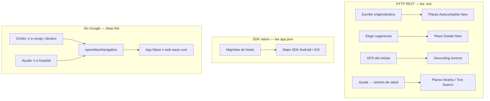

# Google Maps / Places y Waze — app móvil Hercom

Resumen de **qué API usa cada cosa**, dónde va la API key y cómo se abre Waze.
Guías detalladas: [google-maps-mobile.md](./google-maps-mobile.md),
[google-places-autocomplete.md](./google-places-autocomplete.md).

---

## Mapa mental



---

## Tabla: qué es cada pieza

| Función en la app | Tecnología | Dónde está la key | Archivo principal |
| --- | --- | --- | --- |
| Autocompletado al tipear | **Places API (New)** REST | `.env` → `EXPO_PUBLIC_GOOGLE_MAPS_API_KEY` | `apps/mobile/src/lib/googlePlaces.ts` |
| Detalle al elegir dirección | **Places API (New)** Place Details | Misma `.env` | `googlePlaces.ts` |
| GPS → dirección + región Perú | **Geocoding API** | Misma `.env` | `googleGeocoding.ts`, `pickupLocation.ts` |
| Mapa dibujado en pantalla | **Maps SDK** (Android/iOS) | `app.json` → `ios.config.googleMapsApiKey` y `android.config.googleMaps.apiKey` | `ClientDashboard` + `react-native-maps` |
| Centros de salud cercanos (ayuda) | **Places API (New)** Nearby / Text Search | Misma `.env` | `nearbyHealthCenters.ts` |
| Navegación turn-by-turn | **Waze** (deep link) | No usa key de Google | `wazeNavigation.ts` |

Misma key de Google Cloud en `.env` y `app.json`, pero el **mapa visual** y las **llamadas REST** son canales distintos.

---

## APIs a habilitar en Google Cloud

1. Geocoding API  
2. Places API (New)  
3. Maps SDK for Android  
4. Maps SDK for iOS  

Restricciones de la key: esas cuatro APIs (más las que uses en el futuro).

---

## Variables y `app.json`

### Desarrollo (Expo)

```env
# apps/mobile/.env
EXPO_PUBLIC_GOOGLE_MAPS_API_KEY=tu_api_key
EXPO_PUBLIC_CONVEX_URL=https://....convex.cloud
```

Reinicia Metro tras cambiar `.env`.

### Mapa nativo

En `apps/mobile/app.json` (misma key):

```json
"ios": {
  "config": { "googleMapsApiKey": "tu_api_key" }
},
"android": {
  "config": {
    "googleMaps": { "apiKey": "tu_api_key" }
  }
}
```

Tras cambiar `app.json`, reinicia con `--clear`. Builds EAS: también en `eas.json` / secrets.

---

## Waze (ya implementado)

No es una API de Google: abre la app Waze (o la web si no está instalada).

```ts
// apps/mobile/src/lib/wazeNavigation.ts
openWazeNavigation({ address, lat, lng })
// → waze://?ll=lat,lng&navigate=yes
// → fallback https://waze.com/ul?...
```

### Cuándo se dispara

| Momento | Destino Waze |
| --- | --- |
| Chofer: «Voy a recoger» | Origen del cliente |
| Chofer: desliza para iniciar viaje | Destino (o 1.ª parada) |
| Chofer: «Abrir Waze a parada N» | Parada actual |
| Chofer: llegó a parada intermedia | Siguiente parada |
| Ayuda → centro de salud | Hospital/clínica elegida |

iOS necesita `LSApplicationQueriesSchemes: ["waze"]` en `app.json` (ya está).

**Requisito:** Waze instalado en el celular; si no, abre el enlace web.

---

## Botón de ayuda (flotante derecho)

Menú de emergencia / soporte (pasajero y chofer):

| Opción | Acción |
| --- | --- |
| Soporte | Llama o WhatsApp al contacto Hercom (`SUPPORT_CONTACT` en código) |
| Llamar a la policía | `tel:105` (Perú) |
| Ir al centro de salud más cercano | Lista cercana (Places) → abrir Waze |

### Centros de salud: ¿vista aparte?

Sí: un **modal/lista corta** (no reutilizar el autocomplete de calles).

Flujo:

1. Pedir GPS (o usar coords de origen si ya hay).
2. Places **Nearby** con tipos `hospital` (+ búsqueda texto «clínica / centro de salud»).
3. Mostrar 5–8 resultados con nombre y dirección.
4. Al tocar uno → `openWazeNavigation`.

No hace falta un flujo completo de «pedido de viaje» a un hospital: es navegación de emergencia.

---

## Costos orientativos

| Evento | API |
| --- | --- |
| Cada pausa al escribir (≥3 chars) | Places Autocomplete |
| Elegir sugerencia | Place Details |
| Detectar GPS | Geocoding (1 por detección) |
| Abrir ayuda → salud | Nearby / Text Search (1 por apertura) |
| Ver mapa | Maps SDK (cuota de carga de mapa) |
| Abrir Waze | Gratis (deep link) |

---

## Solución rápida de problemas

| Síntoma | Qué revisar |
| --- | --- |
| Sugerencias OK, mapa en blanco | `app.json` + Maps SDK habilitados + `--clear` |
| Mapa OK, sin sugerencias | `.env` + Places API (New) + reinicio Metro |
| «invalid circle radius» | Radio ≤ 50 000 m en bias |
| Waze no abre en iOS | `LSApplicationQueriesSchemes` incluye `waze` |
| Hospitales vacíos | GPS denegado o Places Nearby denegado en la key |
