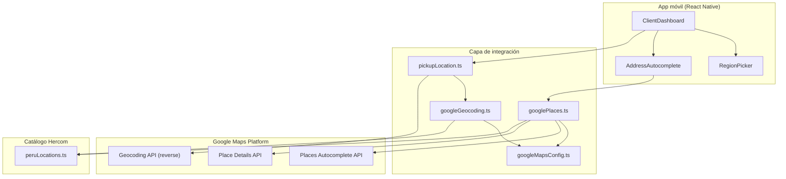

# Autocompletado de direcciones (Google Places) — app móvil

Guía detallada del autocompletado de origen, destino y paradas extra en la
pantalla cliente (`ClientDashboard`). Las sugerencias aparecen mientras el usuario
escribe y se limitan a la **región seleccionada** (departamento, provincia y
opcionalmente distrito en Perú).

Relacionado: [google-maps-mobile.md](./google-maps-mobile.md) (GPS + geocodificación
inversa del origen) · [google-maps-y-waze.md](./google-maps-y-waze.md) (mapa, Waze, ayuda).

---

## Problema que resuelve

Antes, origen y destino eran `TextInput` libres:

- No había sugerencias al tipear.
- El destino se guardaba con `lat: 0, lng: 0`.
- Era fácil escribir direcciones fuera de la provincia operativa.

Ahora el cliente:

1. Detecta o elige su **región** (dept / provincia / distrito).
2. Escribe una dirección y ve **sugerencias de Google Places**.
3. Al elegir una, se guardan **dirección + coordenadas** validadas contra Perú.

---

## Arquitectura



### Archivos principales

| Archivo | Rol |
| --- | --- |
| `apps/mobile/src/components/AddressAutocomplete.tsx` | Campo con debounce, lista de sugerencias y selección |
| `apps/mobile/src/lib/googlePlaces.ts` | Llamadas a Autocomplete + Place Details + filtros de región |
| `apps/mobile/src/lib/googleMapsConfig.ts` | Lectura de `EXPO_PUBLIC_GOOGLE_MAPS_API_KEY` |
| `apps/mobile/src/lib/addressDraft.ts` | Modelo `{ address, lat, lng, placeId }` para destinos |
| `apps/mobile/src/screens/ClientDashboard.tsx` | Formulario de solicitud de viaje |
| `packages/backend/convex/data/peruLocations.ts` | Catálogo oficial dept/provincia/distrito + matching |

---

## APIs de Google necesarias

En [Google Cloud Console](https://console.cloud.google.com/) habilita estas APIs
sobre la misma API key:

| API | Uso en Hercom |
| --- | --- |
| **Geocoding API** | GPS → dirección + región |
| **Places API (New)** | Autocompletado + detalle al elegir sugerencia |

> La app usa **Places API (New)** (`places.googleapis.com/v1/...`), no la API legacy.
> Si ves *"You're calling a legacy API"*, habilita **Places API (New)** en GCP.

> La key es la misma variable `EXPO_PUBLIC_GOOGLE_MAPS_API_KEY`. Solo debes
> habilitar las APIs en el proyecto de Google Cloud.

### Restricciones recomendadas de la key

1. **API restrictions**: Geocoding API + Places API.
2. **Application restrictions** (producción):
   - Android: package `com.proyecto.choferes` + SHA-1 del keystore EAS.
   - iOS: bundle `com.proyecto.choferes`.
3. En desarrollo local puedes dejar la key sin restricción de app (solo por API).

### Variable de entorno

`apps/mobile/.env`:

```env
EXPO_PUBLIC_GOOGLE_MAPS_API_KEY=tu_api_key_aqui
```

Para EAS Build, la misma variable debe existir en `apps/mobile/eas.json` (perfiles
`development`, `preview`, `production`) o como secret en Expo.

Reinicia Metro tras cambiar `.env`:

```powershell
pnpm --filter @proyecto/mobile start
```

---

## Flujo de usuario (paso a paso)

### 1. Región primero

Al abrir el formulario:

- Se intenta **detectar GPS** automáticamente (`detectPickupLocation`).
- Eso rellena departamento, provincia, distrito y la dirección de origen.
- El usuario puede corregir la región en `RegionPicker`.

**Importante:** el autocompletado de direcciones **requiere provincia seleccionada**
para activar sugerencias. Sin provincia, el campo funciona como texto libre con un
aviso.

### 2. Escribir origen o destino

Cuando hay departamento + provincia:

1. El usuario escribe al menos **3 caracteres**.
2. Tras ~320 ms de debounce, se llama a **Places Autocomplete**.
3. Aparece una lista bajo el campo.
4. Al tocar una sugerencia, se llama a **Place Details**.
5. Se valida que el lugar pertenezca a la región elegida.
6. Se guardan `address`, `lat`, `lng` y `placeId`.

### 3. Enviar solicitud

`createService` recibe:

- **Origen:** dirección + coordenadas (GPS o sugerencia elegida).
- **Destino / paradas:** dirección + coordenadas si el usuario eligió sugerencia;
  si escribió manualmente sin elegir, `lat/lng` quedan en `0` (comportamiento
  compatible con el backend actual).

---

## Cómo se limita la búsqueda (reglas de negocio)

| Alcance | ¿Se permite? | Ejemplo |
| --- | --- | --- |
| **Otro país** | No | Chile, Ecuador |
| **Otro departamento** | No | Estás en Lima → no Arequipa |
| **Otra provincia del mismo departamento** | No | Estás en Lima prov. → no Huaral |
| **Otro distrito de la misma provincia** | **Sí** | Estás en Miraflores → sí Surco, San Isidro |

El **distrito** del `RegionPicker` sirve para **promociones**, no para bloquear direcciones.
Si eliges distrito Miraflores, igual puedes poner destino en Santiago de Surco (misma
provincia Lima).

### Capa 1 — Solo Perú (Google)

Parámetro fijo en Autocomplete:

```
components=country:pe
```

Nunca se piden sugerencias fuera del país.

### Capa 2 — Sesgo geográfico (Google)

Radio de **80 km** alrededor del GPS o del centro de la provincia. Prioriza resultados
cercanos dentro de la provincia, sin encerrarte en un solo distrito.

### Capa 3 — Filtro Hercom (app)

**Al listar sugerencias** (`predictionMatchesRegion`):

- El texto debe contener `Perú`.
- Debe mencionar la **provincia** elegida.
- Si provincia y departamento tienen nombres distintos (ej. La Libertad · Trujillo),
  también debe aparecer el **departamento**.
- **No** se filtra por distrito.

**Al seleccionar** (`selectedPlaceMatchesRegion`):

- Place Details devuelve `address_components`.
- Se valida **departamento** y **provincia** contra el catálogo `peruLocations`.
- **No** se valida distrito: cualquier distrito de esa provincia es válido.

Ejemplo: región **Lima · prov. Lima**, distrito detectado Miraflores:

- Origen en Miraflores y destino en Surco → permitido.
- Destino en Arequipa (otro departamento) → rechazado al seleccionar.

---

## Session tokens (facturación Google)

Google agrupa Autocomplete + Place Details en una misma sesión de facturación
cuando comparten `sessiontoken`.

En `googlePlaces.ts`:

- `createPlacesSessionToken()` genera un token al empezar a escribir.
- El mismo token va en Autocomplete y en Details al elegir.
- Tras seleccionar, se genera un **token nuevo** para la siguiente búsqueda.

Esto reduce costo frente a cobrar cada keystroke como búsqueda independiente.

---

## Comportamiento sin API key

Si `EXPO_PUBLIC_GOOGLE_MAPS_API_KEY` no está configurada:

- `AddressAutocomplete` se comporta como `TextInput` normal.
- Se muestra aviso: *"Sin API key de Google: puedes escribir la dirección manualmente"*.
- El GPS nativo del dispositivo (`deviceGeocoding.ts`) sigue intentando región
  sin Google cuando corresponde.

---

## Costos orientativos

| Evento | API | Notas |
| --- | --- | --- |
| Detectar GPS al abrir | Geocoding (reverse) | 1 llamada por detección |
| Cada pausa al escribir (≥3 chars) | Places Autocomplete | Debounce 320 ms reduce llamadas |
| Elegir una sugerencia | Place Details | 1 llamada; misma sesión que Autocomplete |

Monitoriza uso en **Google Cloud → APIs & Services → Dashboard** y configura
alertas de billing.

---

## Solución de problemas

| Síntoma | Causa probable | Qué hacer |
| --- | --- | --- |
| No aparecen sugerencias | Falta provincia en `RegionPicker` | Elige provincia o usa GPS |
| `REQUEST_DENIED` | Places API no habilitada o key inválida | Habilitar Places API en GCP |
| "No hay sugerencias en Lima · Lima" | Texto muy corto o fuera de región | Escribe más caracteres o amplía región |
| "La dirección está fuera de..." | Sugerencia de otra provincia pasó el filtro textual | Elige otra sugerencia o corrige región |
| Destino con lat/lng en 0 | Usuario escribió sin elegir sugerencia | Normal; elegir de la lista guarda coordenadas |
| Sugerencias en Expo Go pero no en APK | Falta key en `eas.json` / secrets EAS | Agregar `EXPO_PUBLIC_GOOGLE_MAPS_API_KEY` al build |

---

## Prueba manual recomendada

1. Configura la API key y habilita las 3 APIs.
2. `pnpm mobile` → inicia sesión como `cliente@demo.com` / `demo1234`.
3. Espera detección GPS o elige **Lima → Lima → Miraflores**.
4. En origen escribe `Larco` → deben salir calles de Miraflores/Lima.
5. Elige una sugerencia → verifica que se rellena la dirección completa.
6. Repite en destino con `Benavides` o un mall conocido.
7. Envía solicitud y revisa en Convex (`services`) que `destination.lat/lng` ≠ 0
   si elegiste sugerencias.

---

## Extender a otras pantallas

El componente `AddressAutocomplete` es reutilizable. Props clave:

```tsx
<AddressAutocomplete
  value={address}
  onChangeText={setAddress}
  onPlaceSelected={(place) => { /* place.lat, place.lng, ... */ }}
  region={{ department: "Lima", province: "Lima", district: "Miraflores" }}
  locationBias={{ lat: -12.12, lng: -77.03 }}
  placeholder="Dirección"
/>
```

Para añadir centros de sesgo de más provincias, edita `PROVINCE_BIAS_CENTERS` en
`googlePlaces.ts`.

---

## Resumen en una frase

**Región del `RegionPicker` + Google Places Autocomplete (solo Perú) + validación
con `peruLocations` = sugerencias locales al tipear, con coordenadas reales al
elegir.**
