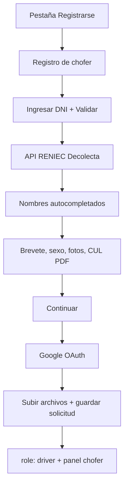

# Registro de choferes (app móvil + RENIEC)

Flujo de alta de chofer con validación de DNI vía **Decolecta** y carga de
documentos en Convex Storage.

---

## Flujo en la app



1. **Registrarse** → **Registro de chofer**
2. DNI (8 dígitos) → **Validar** (RENIEC)
3. Completar brevete, categoría, sexo, fotos y CUL
4. **Continuar** → **Registrarse con Google y enviar**
5. Tras enviar: pantalla *Solicitud enviada* (estado `pending`)

---

## Configurar API Decolecta (obligatorio)

La API key **no va en la app móvil**. Solo en Convex:

```powershell
cd packages/backend
npx convex env set DECOLECTA_API_KEY tu_api_key_de_decolecta
```

> **Estado jul 2026 (cuentas empresa):** si `DECOLECTA_API_KEY` no está en Convex,
> el botón **Validar** en la app **no consulta RENIEC** (modo demo: nombres a mano).
> Además, **Modo conductor** puede crear un perfil chofer mínimo sin documentos
> (`drivers.ensureDemoDriverProfile`). Restaurar esto antes de producción — ver
> [`0 PENDIENTES Y ENV EMPRESA.md`](./0%20PENDIENTES%20Y%20ENV%20EMPRESA.md).

Endpoint usado por el backend:

```
GET https://api.decolecta.com/v1/reniec/dni?numero={DNI}
Authorization: Bearer {DECOLECTA_API_KEY}
```

Código: [`packages/backend/convex/reniec.ts`](../packages/backend/convex/reniec.ts)

---

## Datos guardados

Tabla **`driverApplications`** en Convex:

| Campo | Origen |
| --- | --- |
| `dni`, nombres | RENIEC |
| `licenseNumber`, `licenseCategory` | Formulario |
| `sex` | M / F |
| `licensePhotoIds` | Fotos brevete (Storage) |
| `culPdfId` | PDF CUL (Storage) |
| `status` | `approved` (activa perfil chofer al instante) |

Al enviar la solicitud se crea el perfil en **`drivers`**, se asigna
**`users.role = "driver"`** y la app muestra el panel para **atender viajes**.

---

## Perfiles en la app móvil

| Registro | `users.role` | Vista |
| --- | --- | --- |
| Cliente (Google en Registrarse) | `client` | Solicitar chofer |
| Chofer (formulario + Google) | `driver` | Atender viajes |
| Login normal | según rol guardado | Cliente o chofer |

---

## Aprobar choferes (manual por ahora)

1. [Dashboard Convex → driverApplications](https://dashboard.convex.dev/d/hip-mink-145)
2. Cambia `status` a `approved`
3. Crea fila en **`drivers`** vinculada al `userId` (o automatizar en admin más adelante)

---

## Documentos relacionados

- [flujo-google-auth.md](./flujo-google-auth.md)
- [convex-google-auth.md](./convex-google-auth.md)
